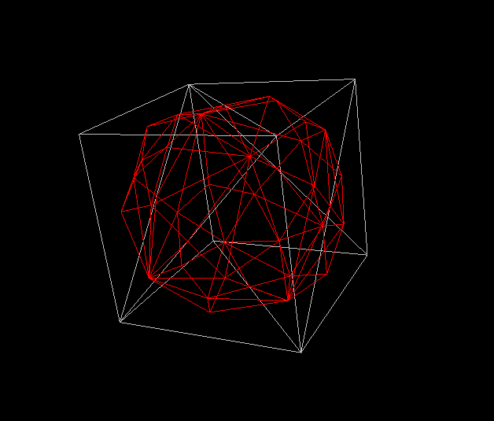
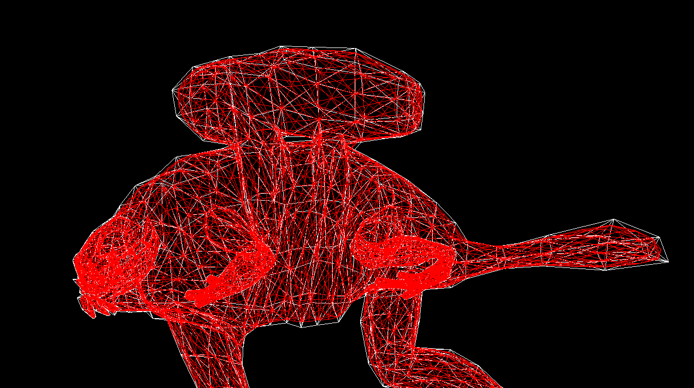

# Computer Graphics Algorithms Collection
goal: study and practicing new algorithms in the Computer Graphics field.

## Algorithms 
+ [Catmull-Clark](https://en.wikipedia.org/wiki/Catmull%E2%80%93Clark_subdivision_surface)

### Catmull-Clark 
the implementation follows the algorithm described in [Wikipedia](https://en.wikipedia.org/wiki/Catmull%E2%80%93Clark_subdivision_surface).
Refined Mesh examples:\
cube\
\
monster frog\

