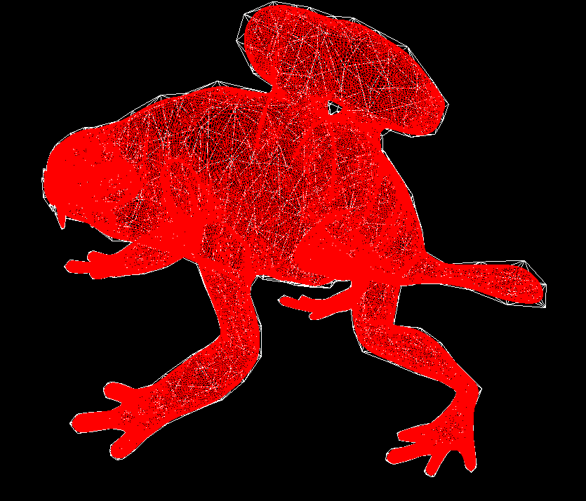

# Computer Graphics Algorithms Collection
goal: study and practicing new algorithms in the Computer Graphics field.

## Algorithms 
- [Computer Graphics Algorithms Collection](#computer-graphics-algorithms-collection)
  - [Algorithms](#algorithms)
    - [Catmull-Clark](#catmull-clark)
    - [Colonization algorithm for 3D trees generation](#colonization-algorithm-for-3d-trees-generation)


---

### Catmull-Clark 


```shell    
python catmull_clark.py
```

the implementation follows the algorithm described in [Wikipedia](https://en.wikipedia.org/wiki/Catmull%E2%80%93Clark_subdivision_surface).


Results:\
cube\
  \
monster frog\


---

### Colonization algorithm for 3D trees generation

```shell    
python tree_generator.py
```

the implementation follows the algorithm described in described in this [paper](http://algorithmicbotany.org/papers/colonization.egwnp2007.large.pdf)


